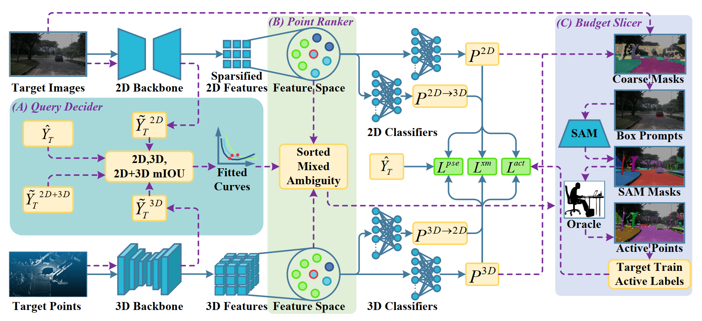

# Omni-Query Active Learning for Source-Free Domain Adaptive Cross-Modality 3D Semantic Segmentation 

This repository is built on [xMUDA](https://github.com/valeoai/xmuda_journal)

## Paper



[Omni-Query Active Learning for Source-Free Domain Adaptive Cross-Modality 3D Semantic Segmentation](https://ojs.aaai.org/index.php/AAAI/article/view/32941) 
Xie, Jianxiang and Wu, Yao and Zhang, Yachao and Shi, Zhongchao and Fan, Jianping and Xie, Yuan and Qu, Yanyun

If you find this code useful for your research, please cite our paper:

```
@inproceedings{xie2025omni,
  title={Omni-Query Active Learning for Source-Free Domain Adaptive Cross-Modality 3D Semantic Segmentation},
  author={Xie, Jianxiang and Wu, Yao and Zhang, Yachao and Shi, Zhongchao and Fan, Jianping and Xie, Yuan and Qu, Yanyun},
  booktitle={Proceedings of the AAAI Conference on Artificial Intelligence},
  volume={39},
  number={8},
  pages={8709--8717},
  year={2025}
}
```

## Preparation

### Prerequisites

Tested with

* PyTorch 1.9.0
* CUDA 11.1
* Python 3.9
* cuml 24.4.0
* [SparseConvNet](https://github.com/facebookresearch/SparseConvNet)
* [nuscenes-devkit](https://github.com/nutonomy/nuscenes-devkit)

### Installation

#### environment

create python environment

```bash
conda create --name omniquery python=3.9
conda activate omniquery
```

install requirements

```bash
# torch & cuda
pip install torch==1.9.0+cu111 torchvision==0.10.0+cu111 torchaudio==0.9.0 -f https://download.pytorch.org/whl/torch_stable.html

# cuml for accelerating K-Neighbors process
pip install --extra-index-url https://pypi.nvidia.com \
    "cudf-cu11==24.4.*" "cuml-cu11==24.4.*"

# other packages
pip install tqdm==4.66.4 scikit-image==0.22.0 scikit-learn==1.4.2

# install SparseConvNet & this project
git clone https://github.com/Kylin-XJX/ActiveSFDA
cd ActiveSFDA

git clone https://github.com/facebookresearch/SparseConvNet.git
cd SparseConvNet-main/
python setup.py install

cd ..
pip install -ve .

```

The `-e` option means that you can edit the code on the fly.

#### SAM

```bash
pip install SAM/
```

Download SAM weights 

- **`default` or `vit_h`: [ViT-H SAM model.](https://dl.fbaipublicfiles.com/segment_anything/sam_vit_h_4b8939.pth)**
- `vit_l`: [ViT-L SAM model.](https://dl.fbaipublicfiles.com/segment_anything/sam_vit_l_0b3195.pth)
- `vit_b`: [ViT-B SAM model.](https://dl.fbaipublicfiles.com/segment_anything/sam_vit_b_01ec64.pth)

#### Annotator and ReDAL

For Annotator and ReDAL, please refer to [Annotator](https://github.com/BIT-DA/Annotator) and [ReDAL](https://github.com/tsunghan-wu/ReDAL) repository. We extracted the core code related to this paper from these two projects and placed it under ADA/Annotator and ADA/ReDAL.

### Datasets

```bash
# in ActiveSFDA/
mkdir datasets
cd datasets
```

#### nuScenes-Lidarseg

Please download from the [NuScenes website](https://www.nuscenes.org/nuscenes#download) and extract:

- Full dataset
- nuScenes-lidarseg (All)

make soft link:

```bash
ln -s /path/to/nuscenes ./nuscenes
```

You need to perform preprocessing to generate the data first.
The preprocessing subsamples the 360° LiDAR point cloud to only keep the points that project into the front camera image. All information will be stored in a pickle file (except the images which will be read on-the-fly by the dataloader during training).

Please edit the script `xmuda/data/nuscenes_lidarseg/preprocess.py` as follows and then run it.

* `root_dir` should point to the root directory of the NuScenes dataset
* `out_dir` should point to the desired output directory to store the pickle files

Run  `xmuda/data/nuscenes_lidarseg/preprocess.py` to preprocess NuScenes dataset:

```bash
PYTHONPATH=$(pwd) python xmuda/data/nuscenes_lidarseg/preprocess.py
```

#### SemanticKITTI

Please download the files from the [SemanticKITTI website](http://semantic-kitti.org/dataset.html) and
additionally the [color data](http://www.cvlibs.net/download.php?file=data_odometry_color.zip)
from the [Kitti Odometry website](http://www.cvlibs.net/datasets/kitti/eval_odometry.php). Extract
everything into the same folder.

Similar to NuScenes preprocessing, we save all points that project into the front camera image as well as the segmentation labels to a pickle file.

make soft link:

```bash
ln -s /path/to/semantic_kitti ./semantic_kitti
```

Please edit the script `xmuda/data/semantic_kitti/preprocess.py` as follows and then run it.

* `root_dir` should point to the root directory of the SemanticKITTI dataset
* `out_dir` should point to the desired output directory to store the pickle files

Run  `xmuda/data/semantic_kitti/preprocess.py` to preprocess SemanticKITTI dataset:

```bash
PYTHONPATH=$(pwd) python xmuda/data/semantic_kitti/preprocess.py
```

### Pretrained weights

We use the source only weights trained by xMUDA as initialization in [this Google drive folder](https://drive.google.com/drive/folders/1c6GjzBV2UiWcu4zoNIKsCsfYm1ZRQGPZ?usp=sharing).

```bash
mkdir base_model
cd base_model
.
├── a2d2_semantic_kitti
│   └── uda
│       └── baseline
│           ├── model_2d_100000.pth
│           └── model_3d_075000.pth
├── nuscenes_lidarseg
│   ├── day_night
│   │   └── uda
│   │       └── baseline
│   │           ├── model_2d_100000.pth
│   │           └── model_3d_080000.pth
│   └── usa_singapore
│       └── uda
│           └── baseline
│               ├── model_2d_015000.pth
│               └── model_3d_075000.pth
└── virtual_kitti_semantic_kitti
    └── uda
        └── baseline
            ├── model_2d_002000.pth
            └── model_3d_026000.pth
```

### Pseudo labels

Generate pseudo labels using source model:

usa_singapore

```bash
PYTHONPATH=$(pwd) CUDA_VISIBLE_DEVICES=2 python xmuda/test.py \
--cfg=configs/nuscenes_lidarseg/usa_singapore/uda/xmuda.yaml --pselab --save-ensemble \
--ckpt2d=base_model/nuscenes_lidarseg/usa_singapore/uda/baseline/model_2d_015000.pth \
--ckpt3d=base_model/nuscenes_lidarseg/usa_singapore/uda/baseline/model_3d_075000.pth \
DATASET_TARGET.TEST "('train_singapore',)"
```

day_night

```bash
PYTHONPATH=$(pwd) CUDA_VISIBLE_DEVICES=2 python xmuda/test.py \
--cfg=configs/nuscenes_lidarseg/day_night/uda/xmuda.yaml --pselab --save-ensemble \
--ckpt2d=base_model/nuscenes_lidarseg/day_night/uda/baseline/model_2d_100000.pth \
--ckpt3d=base_model/nuscenes_lidarseg/day_night/uda/baseline/model_3d_080000.pth \
DATASET_TARGET.TEST "('train_night',)"
```

virtual_kitti_semantic_kitti

```bash
PYTHONPATH=$(pwd) CUDA_VISIBLE_DEVICES=2 python xmuda/test.py \
--cfg=configs/virtual_kitti_semantic_kitti/uda/xmuda.yaml --pselab --save-ensemble \
--ckpt2d=base_model/virtual_kitti_semantic_kitti/uda/baseline/model_2d_002000.pth \
--ckpt3d=base_model/virtual_kitti_semantic_kitti/uda/baseline/model_3d_026000.pth \
DATASET_TARGET.TEST "('train',)"
```

a2d2_semantic_kitti

```bash
PYTHONPATH=$(pwd) CUDA_VISIBLE_DEVICES=2 python xmuda/test.py \
--cfg=configs/a2d2_semantic_kitti/uda/xmuda.yaml --pselab --save-ensemble \
--ckpt2d=base_model/a2d2_semantic_kitti/uda/baseline/model_2d_100000.pth \
--ckpt3d=base_model/a2d2_semantic_kitti/uda/baseline/model_3d_075000.pth \
DATASET_TARGET.TEST "('train',)"
```

## SFDA Experiments

Complete the corresponding config and start source free active domain adaptation:

```yaml
# configs/nuscenes_lidarseg/usa_singapore/uda/xmuda_sfada_feat_ent_tune.yaml as an example
DATASET_SOURCE:
  TYPE: "NuScenesLidarSegSCN"
  TRAIN: ("train_usa",)
  NuScenesLidarSegSCN:
    preprocess_dir: ""		# Just leave it empty, source dataset is unavailable
    nuscenes_dir: ""  		# Just leave it empty, source dataset is unavailable
DATASET_TARGET:
  TYPE: "NuScenesLidarSegSCN"
  TRAIN: ("train_singapore",)
  VAL: ("val_singapore",)
  TEST: ("test_singapore",)
  NuScenesLidarSegSCN:
    preprocess_dir: "" 		# path to preprocessed .pkl file folder
    nuscenes_dir: ""  		# path to preprocessed nuscenes dataset
    pselab_paths: ("",)		# Generated pseudo labels path 
    label_mask_path: ""		# Just leave it empty, config placeholder
...
VAL:
  BATCH_SIZE: 32
  PERIOD: 1000
OUTPUT_DIR: "output/@"		# logs and ckpts output dir 
ADA:
  query_iters: [0.0,-1.0]	# list of timing (0.0~1.0 of training process) to start active query, -1.0 for auto detect by QueryDecider
  r_threshold: 0.85			# tau
  budget: 3.0
  save_dir: ""				# active label mask save dir
  query_function_name: 'get_label_mask_by_feature_entropy_sam' # specifying query function in ADA/utils/query.py
  batch_size: 1
  n_neighbors: 4
  load_mask_from_disk: False
  update_pselab: True
  pselab_save_dir: ""		# new pseudo labels mask save dir
SAM:
  CKPT: ""					# SAM ckpt path
  MODEL_TYPE: "vit_h"
  IMG_SIZE: (225,400)
  delete_road_mask: False
```

Start adaptation:

usa_singapore

```bash
PYTHONPATH=$(pwd) CUDA_VISIBLE_DEVICES=6 python ADA/train_sfada_universal.py \
--cfg configs/nuscenes_lidarseg/usa_singapore/uda/xmuda_sfada_feat_ent_tune.yaml \
--ckpt2d=base_model/nuscenes_lidarseg/usa_singapore/uda/baseline/model_2d_015000.pth \
--ckpt3d=base_model/nuscenes_lidarseg/usa_singapore/uda/baseline/model_3d_075000.pth \
--ex_tag omniquery
```

day_night

```bash
PYTHONPATH=$(pwd) CUDA_VISIBLE_DEVICES=6 python ADA/train_sfada_universal.py \
--cfg configs/nuscenes_lidarseg/day_night/uda/xmuda_sfada_feat_ent_daynight.yaml \
--ckpt2d=base_model/nuscenes_lidarseg/day_night/uda/baseline/model_2d_100000.pth \
--ckpt3d=base_model/nuscenes_lidarseg/day_night/uda/baseline/model_3d_080000.pth \
--ex_tag omniquery
```

virtual_kitti_semantic_kitti

```bash
PYTHONPATH=$(pwd) CUDA_VISIBLE_DEVICES=6 python ADA/train_sfada_universal.py \
--cfg configs/virtual_kitti_semantic_kitti/uda/xmuda_sfada_feat_ent.yaml \
--ckpt2d=base_model/virtual_kitti_semantic_kitti/uda/baseline/model_2d_002000.pth \
--ckpt3d=base_model/virtual_kitti_semantic_kitti/uda/baseline/model_3d_026000.pth \
--dataset_trg SemanticKITTISCN \
--winsize 6 \
--ex_tag omniquery
```

We set the size of slide window for result smoothing in virtual_kitti_semantic_kitti scenario to 6 because it only run for 30000 iterations.

a2d2_semantic_kitti

```bash
PYTHONPATH=$(pwd) CUDA_VISIBLE_DEVICES=6 python ADA/train_sfada_universal.py \
--cfg configs/a2d2_semantic_kitti/uda/xmuda_sfada_feat_ent.yaml \
--ckpt2d=base_model/a2d2_semantic_kitti/uda/baseline/model_2d_100000.pth \
--ckpt3d=base_model/a2d2_semantic_kitti/uda/baseline/model_3d_075000.pth \
--dataset_trg SemanticKITTISCN \
--ex_tag omniquery
```

When the adaptation is over, we can directly obtain the results. 

## Acknowledgment

We sincerely thank the pioneers in the field and their open source works:

 [xMUDA](https://github.com/valeoai/xmuda_journal)

 [Annotator](https://github.com/BIT-DA/Annotator)

 [ReDAL](https://github.com/tsunghan-wu/ReDAL)

